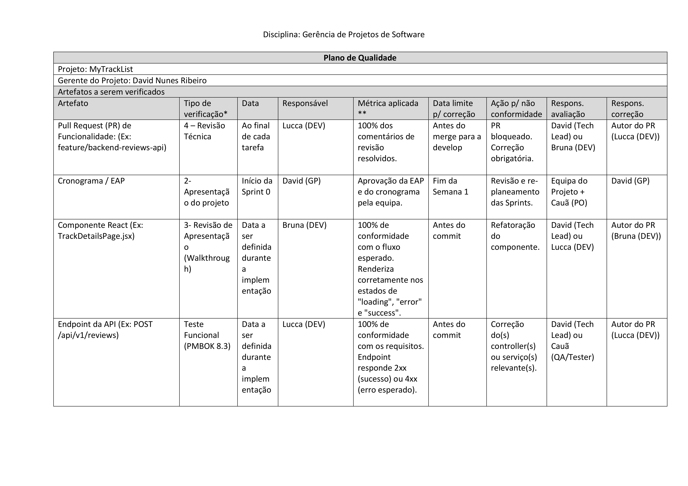
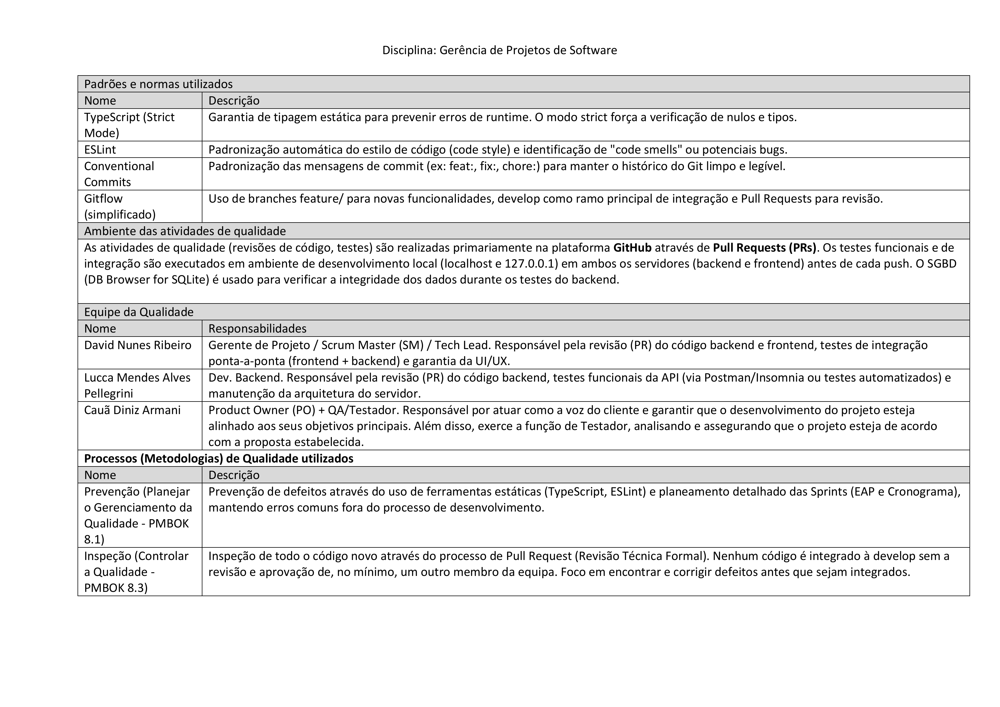
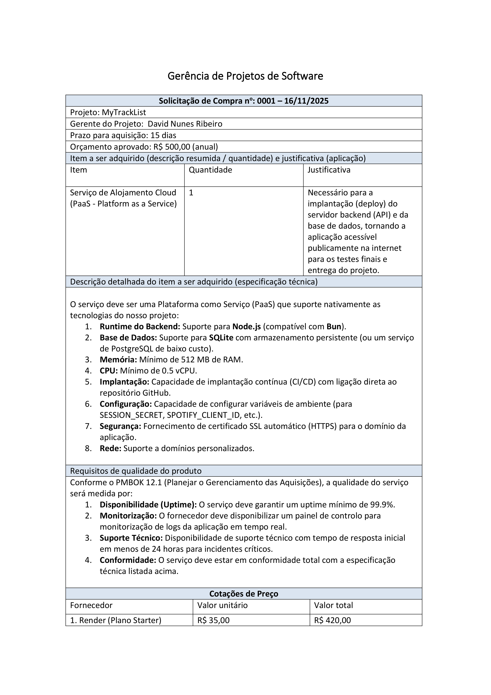
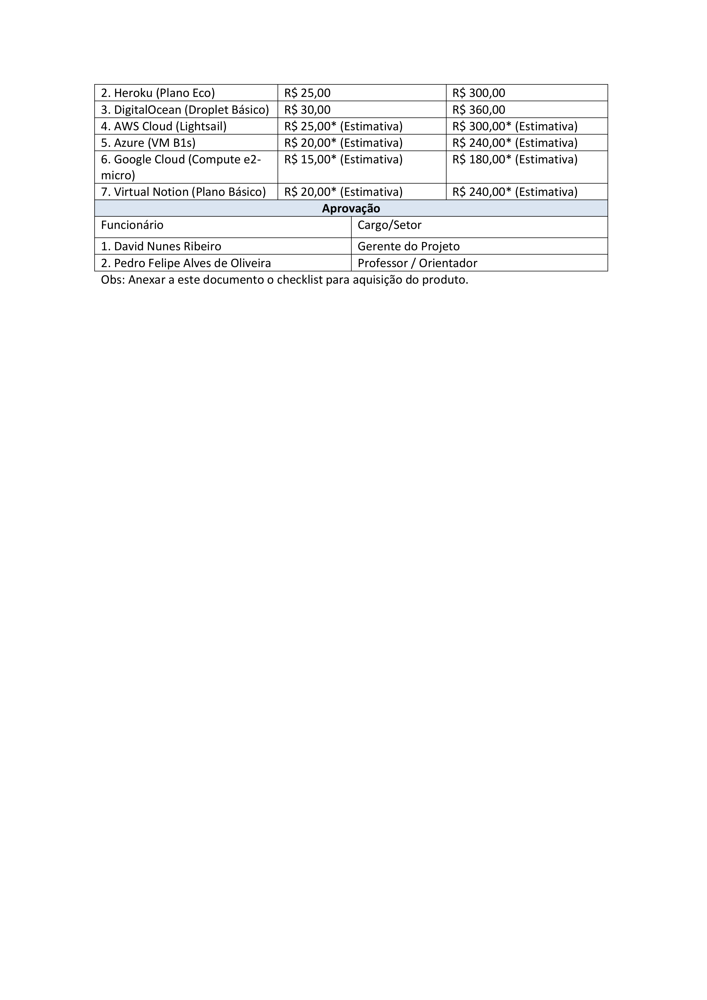

# Planejamento

> A fase de planejamento na gerência de projetos é um momento onde os detalhes do projeto são minuciosamente definidos para garantir uma execução bem-sucedida.
> Durante essa etapa, os gerentes de projeto e suas equipes elaboram um plano abrangente que aborda aspectos como cronograma, orçamento, recursos necessários, riscos identificados e métodos de controle.
> O objetivo é criar uma estrutura que guiará as atividades ao longo do projeto, garantindo que metas sejam alcançadas de maneira eficiente.
> O plano de projeto não apenas define as tarefas específicas e suas interdependências, mas também estabelece critérios de sucesso e indicadores de desempenho.
> A qualidade do planejamento influencia diretamente a capacidade da equipe em cumprir prazos, alocar recursos eficientemente e lidar com desafios que possam surgir durante a execução.

# Estrutura do Documento

- [Fase de Planejamento](#planejamento)
- [Escopo do Projeto](#escopo-do-projeto)
- [Estrutura Analítica do Projeto](#estrutura-analítica-do-projeto)
- [Matriz de Responsabilidades](#matriz-de-responsabilidades)
- [Cronograma do Projeto](#cronograma-do-projeto)
- [Orçamento do Projeto](#orçamento-do-projeto)
- [Planos de Gerenciamento](#planos-de-gerenciamento)
  - [Plano de Qualidade](#plano-de-qualidade)
  - [Plano de Aquisição](#plano-de-aquisição)
  - [Plano de Comunicação](#plano-de-comunicação)
  - [Plano de Riscos](#plano-de-riscos)

---

```diff
+ Tarefa 04:
+ Escopo e Estrutura Analítica do Projeto
```

# Escopo do Projeto

## Declaração de Escopo

- **Projeto:** MyTrackList
- **Gerente do Projeto:** David Nunes Ribeiro

### Objetivo do Projeto

Avaliar e compartilhar gostos musicais.

### Escopo do Projeto/Produto

O projeto está dividido em sprints, cada uma com objetivos específicos:

- **Sprint 0 - Configuração e Fundação:** Preparar todo o ambiente de desenvolvimento, incluindo a estrutura do monorepo, inicialização dos projetos de back-end (Node.js/Express) e front-end (React/Vite), e configuração da biblioteca de componentes visuais (MUI).

  - Estudo de viabilidade técnica
  - Levantamento de requisitos
  - Definição dos stakeholders
  - Inicialização e configuração do projeto
  - Termo de abertura

- **Sprint 1 - Autenticação de Usuários:** Implementar um sistema completo de cadastro e login, permitindo que usuários acessem a plataforma de forma segura.

  - Criação da estrutura e rotas básicas do desenvolvimento backend
  - Criação das interfaces de cadastro e autenticação de usuários
  - Definição das paletas de cores, logo e padrão de estilização do site

- **Sprint 2 - Integração com Spotify e Busca:** Integrar a API do Spotify para permitir a busca de músicas na plataforma, com páginas de resultado e de detalhes para cada faixa.

  - Integração com a API do Spotify
  - Criação da página de resultados da busca
  - Criação da página de detalhes da música

- **Sprint 3 - Listas e Avaliações:** Desenvolver a funcionalidade central do MVP, onde usuários logados podem adicionar músicas às suas listas, atribuir uma nota e visualizar sua coleção em uma página de perfil pessoal.

  - Desenvolvimento backend para que o usuário consiga fazer suas avaliações
  - Criação do componente de avaliação que o usuário irá fazer no frontend
  - Criação da página do perfil do usuário

- **Sprint 4 - Perfis Públicos e Finalização:** Implementar a visualização de perfis de outros usuários e preparar a aplicação para a implantação (deploy), realizando testes e revisões finais.
  - Criação de rotas para busca de perfil
  - Criação da página do perfil público
  - Garantir que o frontend exiba para a pessoa que está acessando outro perfil apenas o necessário
  - Fazer revisão de usabilidade e design
  - Preparar frontend e backend para o deploy
  - Realizar os testes finais
  - Treinamento de utilização junto com um manual de instruções

### Limites do Projeto

- Reprodução de músicas diretamente na plataforma.
- Desenvolvimento de um aplicativo móvel nativo (iOS/Android).
- Integração com outros serviços de streaming (Apple Music, Deezer, etc.).
- Funcionalidades sociais avançadas como chat não serão adicionadas.
- Algoritmos de recomendação de músicas.

### Restrições

- **Prazo:** O projeto deve ser concluído dentro do cronograma acadêmico.
- **Recursos:** A equipe é limitada aos alunos integrantes do projeto, utilizando apenas tecnologias e serviços gratuitos.
- **Dependência Externa:** A funcionalidade de busca de músicas depende criticamente da disponibilidade e das regras da API pública do Spotify.

### Premissas

- O projeto atendeu o estudo de viabilidade técnica.
- A equipe possui ou irá adquirir o conhecimento técnico necessário na stack definida.
- A API do Spotify para desenvolvedores permanecerá acessível e gratuita para os propósitos do projeto.
- Os membros da equipe têm acesso ao hardware e software necessários para o desenvolvimento.

### Marcos Agendados e Entregas

| Id. do Marco       | Entregáveis Previstos                  |
| ------------------ | -------------------------------------- |
| 1. Fim da Sprint 0 | Fundação técnica do projeto concluída. |
| 2. Fim da Sprint 1 | Sistema de autenticação funcional.     |
| 3. Fim da Sprint 3 | Funcionalidade de avaliação e listas.  |
| 4. Fim da Sprint 4 | MVP completo.                          |

# Estrutura Analítica do Projeto

A Estrutura Analítica do Projeto (EAP) para o MyTrackList foi elaborada para
decompor o escopo em componentes gerenciáveis, organizados hierarquicamente
desde o nível do projeto geral até as tarefas específicas de cada sprint. Essa
decomposição facilita o planejamento detalhado, a atribuição de
responsabilidades e o monitoramento do progresso, assegurando que todas as
atividades estejam alinhadas com os objetivos descritos acima. Como ilustrado
na imagem abaixo, a EAP inclui elementos como configuração inicial,
desenvolvimento de funcionalidades e finalização.


<!--
### Documento Editável

> Você deve atualiza o seguinte link (ou link correspondente), como o arquivo editável de geração da WBS:
- [Estrutura Analítica do Projeto - Editável](artefatos/estrutura_analitica_projeto.wbs)
-->

```diff
+ Tarefa 04:
+ Fim da seção a ser atualizada.
```

---

```diff
+ Tarefa 05:
+ Matriz de Responsabilidades (RACI)
```

# Matriz de Responsabilidades

## Matriz RACI

| Atividade                                                                                       | Gerente | Equipe gerenciada | Patrocinador |
| ----------------------------------------------------------------------------------------------- | ------- | ----------------- | ------------ |
| Iniciar o projeto                                                                               | R       | C                 | I            |
| Definir o escopo                                                                                | R       | I                 | A            |
| Elaborar a WBS                                                                                  | R       | I                 | I            |
| Elaborar o cronograma                                                                           | R       | C                 | C            |
| Planejar os riscos                                                                              | R       | C                 | I            |
| Planejar a qualidade                                                                            | R       | C                 | C            |
| Planejar o projeto                                                                              | R       | C                 | I            |
| Monitorar o projeto                                                                             | R       | C                 | I            |
| Encerrar o projeto                                                                              | A       | R                 | A            |
| Realizar garantia da qualidade                                                                  | A       | R                 | C            |
| Realizar controle da qualidade                                                                  | A       | R                 | I            |
| Estudo de viabilidade                                                                           | R       | C                 | I            |
| Levantamento de requisitos                                                                      | R       | C                 | C            |
| Definição de Stakeholders                                                                       | R       | I                 | I            |
| Criação das interfaces de cadastro e autenticação dos usuários                                  | C       | R                 | I            |
| Criação da estrutura e rotas básicas do backend                                                 | C       | R                 | I            |
| Definição das paletas de cores, logo e padrão de estilização do site                            | C       | R                 | A            |
| Integração com a API do Spotify                                                                 | C       | R                 | I            |
| Criação da página de resultados da busca                                                        | C       | R                 | I            |
| Criação da página de detalhes da música                                                         | C       | R                 | I            |
| Desenvolvimento backend para avaliações dos usuários                                            | C       | R                 | I            |
| Criação do componente de avaliação no frontend                                                  | C       | R                 | I            |
| Criação da página de perfil do usuário                                                          | C       | R                 | I            |
| Criação de rotas para busca de perfil                                                           | C       | R                 | I            |
| Criação da página do perfil público                                                             | C       | R                 | I            |
| Garantir que o frontend exiba para a pessoa que está acessando outro perfil apenas o necessário | C       | R                 | I            |
| Fazer revisão de usabilidade e design                                                           | A       | R                 | A            |
| Preparar frontend e backend para o deploy                                                       | R       | R                 | I            |
| Realizar os testes finais                                                                       | A       | R                 | C            |
| Treinamento de utilização junto com um manual de instruções                                     | C       | R                 | A            |

## Recursos Humanos

| Nome                   | Papel                   | Nível de Proficiência | Treimentos Necessários                                          |
| ---------------------- | ----------------------- | --------------------- | --------------------------------------------------------------- |
| Cauã Diniz Armani      | Product Owner           | Suficiente            | Aprender a escrever "Histórias de Usuário"                      |
| Cauã Diniz Armani      | QA/Testador             | Baixo                 | Aprender a usar as "Ferramentas de desenvolvedor" no navegador" |
| Bruna de Paula Anselmi | Desenvolvedor Front-end | Baixo                 | DIW                                                             |
| Bruna de Paula Anselmi | UX/UI Designer          | Suficiente            | Aprender o avançado do Figma                                    |
| Davd Nunes Ribeiro     | Scrum Master            | Bom                   | Arquitetura de Software e Padrões de Projeto                    |
| Davd Nunes Ribeiro     | Tech Lead               | Bom                   | Arquitetura de Software e Padrões de Projeto                    |
| Davd Nunes Ribeiro     | GP                      | Suficiente            | Habilidades de Liderança e Influência                           |
| Lucca Pellegrini       | Desenvolvedor Back-end  | Suficiente            | Treinamento de TypeScript                                       |


<!--
### Documento Editável

> Você deve atualiza o seguinte link (ou link correspondente), como o arquivo editável da Matriz RACI:
- [Matriz de Responsabilidades (RACI) - Editável](artefatos/matriz-raci.docx)
-->

```diff
+ Tarefa 05:
+ Fim da seção a ser atualizada.
```

---

```diff
+ Tarefa 07:
+ Cronograma do Projeto
```

# Cronograma do Projeto

O cronograma do projeto MyTrackList abrange um período total de 90 dias úteis,
iniciando em 17/10/2025 e concluindo em 14/01/2026. Ele é organizado em cinco
sprints: Sprint 0 (configuração e fundação, 15 dias), Sprint 1 (autenticação de
usuários, 20 dias), Sprint 2 (integração com Spotify e busca, 20 dias), Sprint
3 (listas e avaliações, 20 dias) e Sprint 4 (perfis públicos e finalização, 15
dias). As atividades incluem desenvolvimento de backend e frontend, integração
de APIs, testes finais e deploy, com reuniões de planejamento semanais para
cada sprint. Dependências entre tarefas são consideradas para garantir um fluxo
eficiente, e o cronograma visa otimizar recursos e antecipar possíveis atrasos.


### Documento Editável

- [Cronograma do Projeto - Editável](artefatos/cronograma.pod)

```diff
+ Tarefa 07:
+ Fim da seção a ser atualizada.
```

---

```diff
+ Tarefa 08:
+ Orçamento do Projeto
```

# Orçamento do Projeto


### Documento Editável

- [Cronograma e Orçamento do Projeto - Editável](artefatos/cronograma_orcamento.pod)

```diff
+ Tarefa 08:
+ Fim da seção a ser atualizada.
```

# Planos de Gerenciamento

> Os planos de gerenciamento do projetos consolidam as diretrizes e estratégias para a execução bem-sucedida de um empreendimento.
> Ele abrange diversos aspectos, como escopo, cronograma, custos, riscos, qualidade, recursos humanos, comunicação e aquisições, proporcionando uma visão abrangente e integrada do projeto.
> Este plano funciona como um guia mestre que orienta a equipe de projeto e as partes interessadas ao longo do ciclo de vida do projeto, estabelecendo expectativas, responsabilidades e processos.
> Além disso, serve como um instrumento de comunicação, alinhando as expectativas entre os membros da equipe e as partes interessadas, mitigando riscos e fornecendo uma estrutura sólida para a tomada de decisões.

```diff
+ Tarefa 09:
+ Checklist de Qualidade
```

## Plano de Qualidade

O nosso Plano de Qualidade visa à garantia da conformidade e da qualidade dos
artefatos por meio de verificações técnicas, testes funcionais e revisões.
Inclui artefatos como Pull Requests (revisão técnica), componentes React
(revisão de apresentação) e endpoints de API (teste funcional), com métricas
como resolução de 100% dos comentários de revisão e conformidade com fluxos
esperados. Padrões adotados incluem TypeScript Strict Mode, ESLint,
Conventional Commits e Gitflow. Atividades ocorrem via GitHub PRs, ambientes
locais de desenvolvimento e ferramentas como DB Browser. Metodologias seguem
PMBOK: Prevenção (ferramentas estáticas e planejamento), Inspeção (revisões via
PR) e Teste Funcional (verificação manual antes do commit).

> O Plano de Qualidade auxilia a garantir que as entregas do projeto atendam aos padrões de qualidade definidos.
> Este plano abrange atividades como definição de padrões, procedimentos de garantia de qualidade, critérios de aceitação e processos de monitoramento e controle da qualidade ao longo do ciclo de vida do projeto.
> Ao identificar metas de qualidade, responsabilidades da equipe, e métricas de avaliação, o Plano de Qualidade busca assegurar que o projeto atinja ou exceda as expectativas dos stakeholders em termos de desempenho e conformidade.
> A adoção de políticas de qualidade auxilia a mitigar riscos, promove a confiança nas entregas do projeto e, por fim, aumenta a probabilidade de sucesso do empreendimento.

> Referência - Conceitual
>
> - https://www.researchgate.net/publication/230636169_Software_Quality_Assurance

> Normas de Qualidade:
>
> - https://repositorium.uminho.pt/bitstream/1822/27266/1/Tese_MEI_PG19676_Juliana%20Oliveira.pdf
> - https://cin.ufpe.br/~processos/TAES3/Livro/00-LIVRO/07-Normas%20ISO%20e%20Qualidade%20de%20Software-v6_CORRIGIDO.pdf

> Métricas de software:
>
> - https://repositorio.unicamp.br/Busca/Download?codigoArquivo=489087
> - https://lume.ufrgs.br/bitstream/handle/10183/66095/000870909.pdf?sequence=1
> - https://www.computerweekly.com/br/tip/23-metricas-de-desenvolvimento-de-software-que-devem-ser-monitoradas

> Processos de Garantia da Qualidade de Software
>
> - https://ceur-ws.org/Vol-3200/paper22.pdf
> - https://citeseerx.ist.psu.edu/document?repid=rep1&type=pdf&doi=d6bd60206282a2d4449e414e81a703612ef78a0c
> - https://www.testbytes.net/blog/quality-assurance-process-methodology/
> - https://www.projectmanager.com/blog/quality-assurance-and-testing

> Você pode utilizar como referência o seguinte documento:
> [Checklist de Qualidade](artefatos/checklist_qualidade.docx)





### Artefatos a serem verificados

| Artefato                                                              | Tipo Verif.                              | Data                                        | Responsável | Métrica                                                                                                                                                                                                          | Data Correção                 | Ação Não Conform.                                        | Resp. Avaliação                       | Resp. Correção            |
| --------------------------------------------------------------------- | ---------------------------------------- | ------------------------------------------- | ----------- | ---------------------------------------------------------------------------------------------------------------------------------------------------------------------------------------------------------------- | ----------------------------- | -------------------------------------------------------- | ------------------------------------- | ------------------------- |
| Pull Request (PR) de Funcionalidade (Ex: feature/backend-reviews-api) | 4 – Revisão Técnica                      | Ao final de cada tarefa                     | Lucca (DEV) | 100% dos comentários de revisão resolvidos.                                                                                                                                                                      | Antes do merge para a develop | PR bloqueado. Correção obrigatória.                      | David (Tech Lead) ou Bruna (DEV)      | Autor do PR (Lucca (DEV)) |
| Cronograma / EAP                                                      | 2- Apresentação do projeto               | Início da Sprint 0                          | David (GP)  | Aprovação da EAP e do cronograma pela equipa.                                                                                                                                                                    | Fim da Semana 1               | Revisão e re-planeamento das Sprints.                    | Equipa do Projeto + Cauã (PO)         | David (GP)                |
| Componente React (Ex: TrackDetailsPage.jsx)                           | 3- Revisão de Apresentação (Walkthrough) | Data a ser definida durante a implementação | Bruna (DEV) | Antes do commit: Refatoração do componente.                                                                                                                                                                      | Antes do commit               | Refatoração do componente.                               | David (Tech Lead) ou Lucca (DEV)      | Autor do PR (Bruna (DEV)) |
| Endpoint da API (Ex: POST /api/v1/reviews)                            | Teste Funcional (PMBOK 8.3)              | Data a ser definida durante a implementação | Lucca (DEV) | 100% de conformidade com o fluxo esperado. Renderiza corretamente nos estados de "loading", "error" e "success". 100% de conformidade com os requisitos. Endpoint responde 2xx (sucesso) ou 4xx (erro esperado). | Antes do commit               | Correção do(s) controller(s) ou serviço(s) relevante(s). | David (Tech Lead) ou Cauã (QA/Tester) | Autor do PR (Lucca (DEV)) |

### Padrões e Normas Utilizadas

| Nome                     | Descrição                                                                                                                    |
| ------------------------ | ---------------------------------------------------------------------------------------------------------------------------- |
| TypeScript (Strict Mode) | Garantia de tipagem estática para prevenir erros de runtime. O modo strict força a verificação de nulos e tipos.             |
| ESLint                   | Padronização automática do estilo de código (code style) e identificação de "code smells" ou potenciais bugs.                |
| Conventional Commits     | Padronização das mensagens de commit (ex: feat:, fix:, chore:) para manter o histórico do Git limpo e legível.               |
| Gitflow (simplificado)   | Uso de branches feature/ para novas funcionalidades, develop como ramo principal de integração e Pull Requests para revisão. |

### Ambiente das Atividades de Qualidade

| Ambiente                          | Descrição                                                                                                                                                                        |
| --------------------------------- | -------------------------------------------------------------------------------------------------------------------------------------------------------------------------------- |
| GitHub Pull Requests              | As atividades de qualidade (revisões de código, testes) são realizadas primariamente na plataforma GitHub através de Pull Requests (PRs).                                        |
| Ambiente de Desenvolvimento Local | Os testes funcionais e de integração são executados em ambiente de desenvolvimento local (localhost e 127.0.0.1) em ambos os servidores (backend e frontend) antes de cada push. |
| SGBD (DB Browser for SQLite)      | O SGBD (DB Browser for SQLite) é usado para verificar a integridade dos dados durante os testes do backend.                                                                      |

### Equipe de Qualidade

| Nome                          | Responsabilidade                                                                                                                                                                                                                                                                                       |
| ----------------------------- | ------------------------------------------------------------------------------------------------------------------------------------------------------------------------------------------------------------------------------------------------------------------------------------------------------ |
| David Nunes Ribeiro           | Gerente do Projeto / Scrum Master (SM) / Tech Lead. Responsável pela revisão (PR) do código backend e frontend, testes de integração ponta-a-ponta (frontend + backend) e garantia da UI/UX.                                                                                                           |
| Lucca Mendes Alves Pellegrini | Dev. Backend. Responsável pela revisão (PR) do código backend, testes funcionais da API (via Postman/Insomnia ou testes automatizados) e manutenção da arquitetura do servidor.                                                                                                                        |
| Cauã Diniz Armani             | Product Owner (PO) + QA/Testador. Responsável por atuar como a voz do cliente e garantir que o desenvolvimento do projeto esteja alinhado aos seus objetivos principais. Além disso, exerce a função de Testador, analisando e assegurando que o projeto esteja de acordo com a proposta estabelecida. |
| Bruna de Paula Anselmi        | Dev Front-end / UX/UI Designer. Responsável pela revisão (PR) do código frontend, testes funcionais de componentes React, garantia da usabilidade e design, e participação em revisões de apresentação (walkthrough).                                                                                  |

### Metodologias de Qualidade Utilizadas

| Nome                                                   | Descrição                                                                                                                                                                                                                                                              |
| ------------------------------------------------------ | ---------------------------------------------------------------------------------------------------------------------------------------------------------------------------------------------------------------------------------------------------------------------- |
| Prevenção (Planejar Prevenção de defeitos - PMBOK 8.1) | Prevenção de defeitos através do uso de ferramentas estáticas (TypeScript, ESLint) e planejamento detalhado das Sprints (EAP e Cronograma), mantendo erros comuns fora do processo de desenvolvimento.                                                                 |
| Inspeção (Controlar a Qualidade - PMBOK 8.3)           | Inspeção de todo o código novo através do processo de Pull Request (Revisão Técnica Formal). Nenhum código é integrado à develop sem a revisão e aprovação de, no mínimo, um outro membro da equipa. Foco em encontrar e corrigir defeitos antes que sejam integrados. |
| Teste Funcional (Gerenciar a Qualidade - PMBOK 8.2)    | Processo de verificação manual executado pelo próprio desenvolvedor para garantir que a funcionalidade implementada atende aos requisitos definidos na tarefa, antes de submeter o código para a Revisão Técnica (PR).                                                 |

```diff
+ Tarefa 09:
+ Fim da seção a ser atualizada.
```

```diff
+ Tarefa 10:
+ Especificação de Produto para Aquisição
```

## Plano de Aquisição

> O Plano de Aquisições define o processo relacionado à aquisição de bens e serviços necessários para a execução do projeto.
> Este plano abrange a identificação de necessidades, a seleção de fornecedores, a elaboração de contratos, e a gestão do relacionamento com os fornecedores durante do ciclo de vida do projeto.
> O Plano de Aquisições visa garantir a aquisição eficiente e eficaz dos recursos necessários, minimizando riscos e custos.
> Além disso, ele proporciona transparência nas relações com fornecedores, promovendo a conformidade com os prazos estabelecidos e padrões de qualidade.

### Solicitação de Compra

**Solicitação de Compra no: 0001 – 16/11/2025**
**Projeto: MyTrackList**
**Gerente do Projeto: David Nunes Ribeiro**
**Prazo para aquisição: 15 dias**
**Orçamento aprovado: R$ 500,00 (anual)**

#### Item a ser adquirido (descrição resumida / quantidade) e justificativa (aplicação)

| Item                                                       | Quantidade | Justificativa                                                                                                                                                                            |
| ---------------------------------------------------------- | ---------- | ---------------------------------------------------------------------------------------------------------------------------------------------------------------------------------------- |
| Serviço de Alojamento Cloud (PaaS - Platform as a Service) | 1          | Necessário para a implantação (deploy) do servidor backend (API) e da base de dados, tornando a aplicação acessível publicamente na internet para os testes finais e entrega do projeto. |

#### Descrição detalhada do item a ser adquirido (especificação técnica)

O serviço deve ser uma Plataforma como Serviço (PaaS) que suporte nativamente as tecnologias do nosso projeto:

1. Runtime do Backend: Suporte para Node.js (compatível com Bun).
2. Base de Dados: Suporte para SQLite com armazenamento persistente (ou um serviço de PostgreSQL de baixo custo).
3. Memória: Mínimo de 512 MB de RAM.
4. CPU: Mínimo de 0.5 vCPU.
5. Implantação: Capacidade de implantação contínua (CI/CD) com ligação direta ao repositório GitHub.
6. Configuração: Capacidade de configurar variáveis de ambiente (para SESSION_SECRET, SPOTIFY_CLIENT_ID, etc.).
7. Segurança: Fornecimento de certificado SSL automático (HTTPS) para o domínio da aplicação.
8. Rede: Suporte a domínios personalizados.

#### Requisitos de qualidade do produto

Conforme o PMBOK 12.1 (Planejar o Gerenciamento das Aquisições), a qualidade do serviço será medida por:

1. Disponibilidade (Uptime): O serviço deve garantir um uptime mínimo de 99.9%.
2. Monitorização: O fornecedor deve disponibilizar um painel de controlo para monitorização de logs da aplicação em tempo real.
3. Suporte Técnico: Disponibilidade de suporte técnico com tempo de resposta inicial em menos de 24 horas para incidentes críticos.
4. Conformidade: O serviço deve estar em conformidade total com a especificação técnica listada acima.

#### Cotações de Preço

| Fornecedor                         | Valor unitário          | Valor total              |
| ---------------------------------- | ----------------------- | ------------------------ |
| 1. Render (Plano Starter)          | R$ 35,00                | R$ 420,00                |
| 2. Heroku (Plano Eco)              | R$ 25,00                | R$ 300,00                |
| 3. DigitalOcean (Droplet Básico)   | R$ 30,00                | R$ 360,00                |
| 4. AWS Cloud (Lightsail)           | R$ 25,00\* (Estimativa) | R$ 300,00\* (Estimativa) |
| 5. Azure (VM B1s)                  | R$ 20,00\* (Estimativa) | R$ 240,00\* (Estimativa) |
| 6. Google Cloud (Compute e2-micro) | R$ 15,00\* (Estimativa) | R$ 180,00\* (Estimativa) |
| 7. Virtual Notion (Plano Básico)   | R$ 20,00\* (Estimativa) | R$ 240,00\* (Estimativa) |

#### Aprovação

| Funcionário                       | Cargo/Setor            |
| --------------------------------- | ---------------------- |
| 1. David Nunes Ribeiro            | Gerente do Projeto     |
| 2. Pedro Felipe Alves de Oliveira | Professor / Orientador |




<!-- ### Documento Editável

> Você deve atualiza o seguinte link (ou link correspondente), como o arquivo editável de geração da WBS:

- [Especificação Produto Aquisição - Editável](artefatos/aquisicao_produtos.docx) -->

```diff
+ Tarefa 10:
+ Fim da seção a ser atualizada.
```

```diff
+ Tarefa 11:
+ Plano de Comunicação
```

## Plano de Comunicação

O Plano de Comunicação do projeto MyTrackList estabelece estratégias para troca
de informações entre equipe e stakeholders, utilizando ferramentas como GitHub
(para gestão de tarefas e documentação), WhatsApp (comunicações informais) e
Discord (reuniões virtuais). Inclui entregáveis como atas de reuniões,
declaração de escopo, WBS, cronograma, lista de riscos, plano de qualidade,
checklists de inspeção e plano de aquisições, com frequências variando de
contínua/diária a semanal/eventual. Princípios enfatizam comunicação
assíncrona, transparência e eficiência em reuniões síncronas.

> O Plano de Comunicação estabelece estratégias e diretrizes para facilitar a troca de informações entre os membros da equipe e as partes interessadas.
> Este plano abrange aspectos como os meios de comunicação, a frequência das atualizações, os canais de distribuição de informações e os responsáveis pela comunicação.
> Uma comunicação eficiente não apenas previne mal-entendidos e conflitos, mas também fortalece o engajamento da equipe e o apoio das partes interessadas.
>
> Você pode utilizar como referência o seguinte documento:

- [Plano de Gerenciamento de Comunicação - Editável](artefatos/plano_comunicacao.docx)

### Plano de Comunicação do Projeto

| Entregável             | Público Alvo                              | Met. Comunicação                                          | Frequência                          | Responsável                |
| ---------------------- | ----------------------------------------- | --------------------------------------------------------- | ----------------------------------- | -------------------------- |
| Ata de reunião         | Equipe do Projeto, Pedro Felipe (Sponsor) | Documento partilhado (.md no GitHub)                      | Semanal (Reunião de Sprint)         | David (Gerente de Projeto) |
| Declaração de escopo   | Equipe do Projeto, Pedro Felipe (Sponsor) | Documento Mestre (Plano Completo do Projeto.md no GitHub) | No início do projeto (Sprint 0)     | David (Gerente de Projeto) |
| WBS                    | Equipe do Projeto                         | GitHub Projects (Quadro Kanban)                           | Atualização Contínua / Diária       | Equipe de Desenvolvimento  |
| Cronograma             | Equipe do Projeto, Pedro Felipe (Sponsor) | Documento Mestre (Plano Completo do Projeto.md no GitHub) | Reunião Virtual / GitHub Issues     | David (Gerente de Projeto) |
| Lista de Riscos        | Equipe do Projeto                         | Revisão Semanal (Reunião de Sprint)                       | Início de cada Sprint               | David (Gerente de Projeto) |
| Plano de qualidade     | Equipe do Projeto, Pedro Felipe (Sponsor) | Documento Mestre (Plano de Qualidade.md no GitHub)        | No início do projeto (Sprint 0)     | David (Gerente de Projeto) |
| Checklists de Inspeção | Equipe de Desenvolvimento                 | GitHub Pull Requests (Comentários e Aprovações)           | Eventual (Para cada tarefa/feature) | Desenvolvedores            |
| Plano de Aquisições    | Equipe do Projeto, Pedro Felipe (Sponsor) | Documento Mestre (Solicitação de Compra.md no GitHub)     | Eventual (Sprint 4)                 | David (Gerente de Projeto) |

> Legenda:
>
> - Público: a quem se destina a comunicação.
> - Método de Comunicação: e_mail, reunião presencial, reunião virtual, etc.
> - Freqüência: diária, semanal, quinzenal, mensal, etc.
> - Responsável: pessoa responsável pela comunicação.

### Plano de Gerência de Comunicação

> Indique:
>
> - Ferramentas utilizadas no projeto - adicionar link de acesso às ferramentas
> - Papéis: responsáveis pelas correspondentes no projeto
> - Princípios gerais: indica quais princípios serão adotados no plano de comunicação, como clareza, objetividade, impessoalidade, imparcialidade e cordialidade. Detalhar.
>
> Plano de Gerência de Configuração: definir, em linhas gerais, como (ferramenta) serão controladas e distribuídas as versões e se haverá algum controle de responsabilidades.

- Ferramentas utilizadas:
  - GitHub: Para gestão de tarefas (Projects), revisão de código (Pull Requests), documentação (Markdown) e registo de problemas (Issues).
  - WhatsApp (Chat Assíncrono): Para comunicações rápidas, informais e resolução de bloqueios diários.
  - Discord (Reunião Virtual): Para reuniões síncronas de planeamento e revisão de Sprint.
- Papéis:
  - Equipe de Desenvolvimento (Frontend/Backend): Responsável por atualizar o Kanban, comunicar o progresso e revisar o código (comunicação horizontal).
  - Gerente de Projeto: Responsável por consolidar o progresso, gerir o cronograma e comunicar o status geral ao Professor (comunicação vertical).
  - Professor (Sponsor): Público-alvo principal dos relatórios formais e entregas.
- Princípios gerais
  - Seguir a LGPD (se aplicável a dados de utilizadores).
  - Preferência por comunicação assíncrona: Manter um registo de todas as decisões técnicas e de progresso no GitHub (Issues e PRs).
  - Transparência: O Quadro Kanban no GitHub deve refletir sempre o estado real das tarefas.
  - Frequência: Reuniões síncronas (virtuais) são reservadas para planeamento (início da Sprint) e revisão (final da Sprint) para otimizar o tempo de desenvolvimento.

```diff
+ Tarefa 11:
+ Fim da seção a ser atualizada.
```

```diff
+ Tarefa 12:
+ Riscos do Projeto
```

## Plano de Riscos

O Plano de Riscos do projeto MyTrackList identifica, analisa e mitiga potenciais ameaças e oportunidades, categorizando riscos por área (técnica, equipe, cronograma, orçamento, etc.) e definindo medidas preventivas e contingenciais para minimizar impactos e maximizar chances de sucesso.

> O plano de riscos busca antecipar, avaliar e mitigar os desafios potenciais que podem surgir ao longo do projeto.
> Este documento estratégico oferece uma visão global dos riscos, categorizando-os e delineando estratégias para lidar com cada uma das possíveis adversidades.
> Inicialmente, é realizada a identificação detalhada dos riscos, abrangendo desde ameaças imprevistas até oportunidades que podem ser exploradas.
> Uma vez catalogados, os riscos são avaliados quanto à sua probabilidade de ocorrência e impacto, permitindo a priorização e foco em áreas críticas.
>
> O plano de riscos não apenas destaca os perigos em potencial, mas também estabelece respostas e estratégias de contingência.
> Isso inclui a definição de ações preventivas para mitigar riscos antes que se materializem, bem como estratégias de mitigação para minimizar seu impacto se ocorrerem.
> Além disso, a identificação de pontos de monitoramento contínuo ao longo do projeto permite uma resposta ágil às mudanças nas condições do ambiente.
>
> Você pode utilizar como referência o seguinte documento:

- [Plano de Gerenciamento de Riscos - Editável](artefatos/plano_riscos.xls)

| Categoria do Risco | Descrição do Risco | Impacto | Risco | Medidas de Prevenção (Contramedidas) | Medidas de Contingência (Mitigação) |
| ------------------ | ------------------ | ------- | ----- | ------------------------------------ | ----------------------------------- |
| Técnico | Falha na integração com a API do Spotify devido a mudanças na API | Alto | Alto | Monitorar documentação oficial da API e manter contato com suporte do Spotify; desenvolver versão mock para testes | Implementar dados mock temporários e buscar alternativas como outras APIs de música |
| Equipe | Saída inesperada de um membro da equipe de desenvolvimento | Alto | Médio | Realizar treinamentos cruzados e manter documentação detalhada; estabelecer contratos de não-concorrência | Redistribuir tarefas entre membros restantes e contratar freelancer temporário se necessário |
| Cronograma | Atrasos em entregas de sprints devido a subestimação de complexidade | Médio | Alto | Realizar reuniões de planejamento detalhado e usar técnicas de estimativa como Planning Poker | Replanejar sprints afetados e ajustar escopo se necessário para manter prazos |
| Orçamento | Custos extras com ferramentas ou serviços de hospedagem | Médio | Médio | Definir orçamento detalhado e reservar contingência de 10%; comparar preços de fornecedores | Negociar preços com fornecedores ou buscar alternativas mais econômicas |
| Segurança | Vazamento de dados de usuários devido a falhas de segurança | Alto | Baixo | Implementar boas práticas de segurança (criptografia, validação) e auditorias regulares | Notificar usuários afetados, corrigir vulnerabilidades e cooperar com autoridades se necessário |
| Qualidade | Bugs críticos não detectados antes do deploy | Médio | Médio | Realizar testes rigorosos (unitários, integração, aceitação) e revisões de código | Corrigir bugs emergencialmente e lançar hotfix; adiar deploy se impacto for alto |
| Stakeholder | Mudanças frequentes nos requisitos por parte do PO | Alto | Médio | Definir processo claro de mudança de escopo e aprovação formal; manter comunicação constante | Avaliar impacto e custo da mudança; renegociar prazos/orçamento se necessário |
| Infraestrutura | Problemas com provedor de hospedagem cloud | Médio | Médio | Escolher provedores confiáveis com SLA alto; ter plano de backup | Migrar para provedor alternativo rapidamente; usar CDN para reduzir carga |
| Dependências Externas | Indisponibilidade temporária da API do Spotify | Alto | Baixo | Implementar cache e retry logic; monitorar status da API | Usar cache offline ou notificar usuários sobre indisponibilidade temporária |
| Saúde | Doença prolongada de um membro chave da equipe | Alto | Baixo | Incentivar trabalho remoto flexível e equilíbrio vida-trabalho; ter seguro saúde | Redistribuir responsabilidades e contratar suporte temporário |
| Mercado | Mudanças nas tendências de mercado afetando relevância do app | Médio | Baixo | Realizar pesquisa de mercado inicial e monitoramento contínuo | Adaptar funcionalidades com base em feedback; pivotar se necessário |
| Legal | Questões de direitos autorais com músicas ou dados | Alto | Baixo | Consultar especialistas legais e garantir compliance com leis de dados | Remover conteúdo infrator e buscar licenças adequadas |
| Comunicação | Falhas na comunicação interna levando a mal-entendidos | Médio | Alto | Estabelecer canais claros (GitHub, Discord) e reuniões regulares | Realizar reuniões de esclarecimento e documentar decisões |
| Recursos | Falta de acesso a hardware/software necessário | Baixo | Médio | Verificar disponibilidade antecipada e ter backups | Usar alternativas open-source ou adquirir recursos adicionais |
| Motivação | Baixa motivação da equipe devido a sobrecarga | Médio | Médio | Promover ambiente positivo, reconhecer conquistas e equilibrar carga de trabalho | Oferecer incentivos ou redistribuir tarefas para evitar burnout |
| Cliente | Feedback negativo pós-lançamento afetando reputação | Médio | Baixo | Coletar feedback beta e implementar melhorias | Responder rapidamente, corrigir issues e comunicar transparências |
| Financeiro | Inflação ou mudanças cambiais afetando custos | Baixo | Baixo | Incluir buffer no orçamento e monitorar índices econômicos | Ajustar orçamento e buscar fontes alternativas de financiamento |
| Tecnologia | Obsolescência de tecnologias escolhidas (ex: Node.js versões antigas) | Médio | Baixo | Escolher tecnologias maduras e manter atualizações regulares | Planejar migração gradual para versões mais recentes |

> Indique:
> Categoria do Risco: _ex.: Cliente, Cronograma, Orçamento, Aquisição de produtos, etc_
> Descrição do Risco: _ex.: Cliente não aparenta ter muito interesse no projeto_
> Impacto: _Baixo / Médio / Alto_
> Risco: _Baixo / Médio / Alto_
> Medidas de Prevenção: _Medidas que devem ser adotadas para evitar que o risco se concretize_
> Medidas de Contingência: _Medidas que devem ser adotadas caso o risco se concretize_
>
> \*Obs.: Para determinar o risco considere a seguinte combinação entre Probabilidade e Impacto:

| Probabilidade | Impacto | Risco |
| ------------- | ------- | ----- |
| Baixo         | Baixo   | Baixo |
| Médio         | Médio   | Médio |
| Alto          | Alto    | Alto  |
| Baixo         | Médio   | Médio |
| Médio         | Baixo   | Médio |
| Baixo         | Alto    | Médio |
| Alto          | Baixo   | Médio |
| Médio         | Alto    | Alto  |
| Alto          | Médio   | Alto  |

```diff
+ Tarefa 12:
+ Fim da seção a ser atualizada.
```

---
